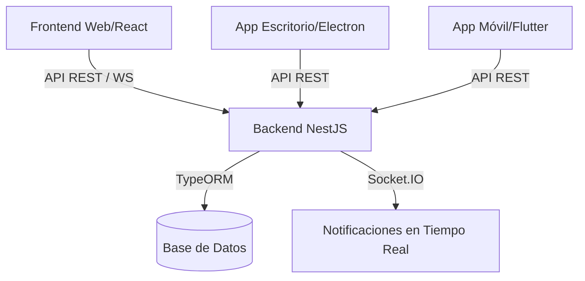

<div align="center">
  
  <h1>🦷 DENTALPLAZA</h1>
  <p><strong>Sistema Integral de Gestión Odontológica Multiplataforma</strong></p>

  [](https://opensource.org/licenses/MIT)
  [](https://vitejs.dev/)
  [](https://nestjs.com/)
  [](https://www.electronjs.org/)
  [](https://flutter.dev/)
</div>

---

## 🌟 Características Principales

DENTALPLAZA es una solución de grado profesional diseñada para modernizar clínicas dentales. Ofrece una experiencia fluida tanto para doctores como para pacientes.

### 👩‍⚕️ Panel Administrativo (Web & Desktop)
- **Gestión de Pacientes:** Ficha clínica digital única con integración de verificación de DNI (RENIEC).
- **Agenda Inteligente:** Control total de citas con estados visuales y sincronización en tiempo real.
- **Logística e Inventario:** Control de stock, alertas de caducidad y gestión de proveedores.
- **Tratamientos y Pagos:** Seguimiento de procedimientos dentales y control de abonos/saldos.
- **Recetas Digitales:** Generación automática de recetas profesionales en formato PDF.
- **Reportes Dinámicos:** Gráficos avanzados de ingresos, rendimiento y KPIs de la clínica.

### 📱 Portal del Paciente (Web & Mobile)
- **Mis Citas:** Seguimiento de próximas visitas y solicitudes de citas nuevas.
- **Historial de Tratamientos:** Visualización detallada de procedimientos realizados.
- **Estado de Cuenta:** Control de pagos realizados y saldos pendientes.
- **Notificaciones:** Alertas instantáneas (WebSockets) sobre confirmaciones y nuevas recetas.

---

## 🎨 Diseño Premium

El sistema ha sido refactorizado bajo estándares modernos de UX/UI:
- **Modo Oscuro/Claro:** Adaptación completa con transiciones suaves.
- **Estética "Glassmorphism":** Interfaz limpia, profesional y visualmente impactante.
- **Animaciones Micro-interactividades:** Feedback visual instantáneo para una mejor experiencia.
- **Diseño Responsivo:** Funciona perfectamente en tablets, laptops y computadoras de escritorio.

---

## 🛠️ Stack Tecnológico

| Capa | Tecnologías |
| :--- | :--- |
| **Backend** | NestJS, PostgreSQL/SQLite, TypeORM, Socket.IO, PDFKit |
| **Frontend** | React 19, Vite, TypeScript, Lucide Icons, Recharts |
| **Desktop** | Electron (Proceso principal optimizado) |
| **Mobile** | Flutter, Dio, Hive, GoRouter |
| **Despliegue** | Docker, Vercel, Supabase, Render |

---

## 🚀 Arquitectura del Sistema



---

## ⚙️ Instalación y Uso Local

### Backend
```bash
cd backend
npm install
npm run start:dev
```

### Frontend (Web & Desktop)
```bash
cd frontend
npm install
npm run dev # Para Web
npm run electron:dev # Para Aplicación de Escritorio
```

### Mobile
```bash
cd mobile
flutter pub get
flutter run
```

---

<div align="center">
  <p>Desarrollado con ❤️ para <strong>Dental Plaza</strong></p>
  <sub>Powered by Antigravity AI</sub>
</div>
